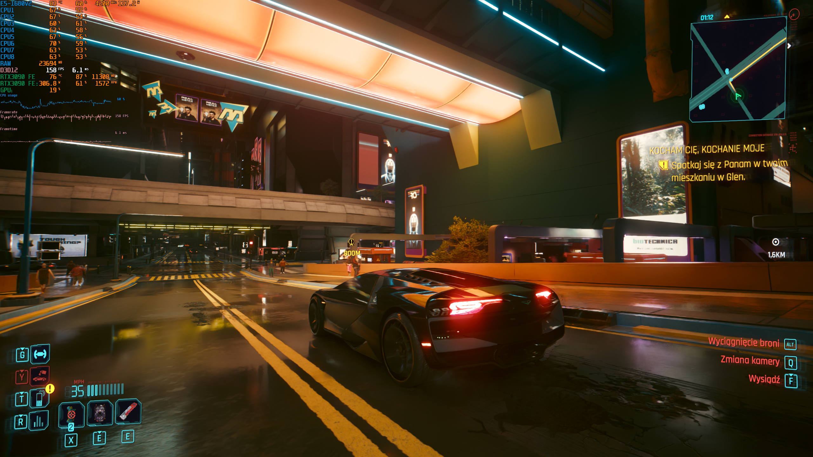

# MFGAmpereUnlock

Enables native NVIDIA DLSS Frame Generation / Multi Frame Generation on **Ada,
Ampere, and Turing** GPUs through a ReShade/RenoDX addon.

<p align="center">
  <a href="docs/media/ampere-screenshot.jpg">
    
  </a>
</p>

Patches are applied to mapped process memory and reverted on unload. **No NVIDIA
binaries are redistributed.**

## Usage

1. Install [ReShade](https://reshade.me/) with addon support, or the appropriate
   [RenoDX](https://github.com/clshortfuse/renodx) mod for the game.
2. Download the [latest release](../../releases/latest).
3. Place `renodx-mfgunlock.addon64` in the ReShade addon location used by the game.
4. Append the following to `ReShade.ini`:

   ```ini
   [ADDON]
   LoadFromDllMain=renodx-mfgunlock.addon64
   ```

   **If omitted, MFG Unlock will append itself automatically; restart the game
   once afterwards for MFG to be detected.**
5. If 3x/4x/6x MFG is unavailable, update
   [`nvngx_dlssg.dll`](https://www.techpowerup.com/download/nvidia-dlss-3-frame-generation-dll/)
   to a recent version.
6. For Dynamic MFG, replace the game's Streamline files with
   [Streamline 2.14.1 with DLSS-G 310.9.1](https://www.nexusmods.com/site/mods/1282?tab=files)
   only in games known to accept a Streamline update. This replacement works, for
   example, in **Cyberpunk 2077**. Do not use it with legacy Streamline 1.x titles
   such as **A Plague Tale: Requiem**.
7. Use the game's multiplier selector when available. Otherwise use **Force frame
   multiplier** in the ReShade **MFG Unlock** panel.

### Dynamic MFG and Validated Warp Blend

- **Dynamic MFG** is available on **Ampere (RTX 30)** and **Turing (RTX 20)** with
  the supported Streamline/DLSS-G stack. NVIDIA varies the multiplier toward the
  selected output FPS.
- **Validated Warp Blend** improves later-stage reprojection on RTX 20/30 with
  DLSS-G **310.9.1**. Enable it and restart the game.
- Advanced/debug contains Warp diagnostic modes; normal use stays on
  **Validated Warp**.

### Intermediate Scatter Retention and Boundary Artifact Mitigation

- **Intermediate Scatter Retention** improves preservation of thin geometry and
  small moving details in generated frames on RTX 20/30 with DLSS-G **310.9.1**.
- **Boundary Artifact Mitigation** controls how ISR behaves near object edges.
  **Off** keeps the `0.10-pre1` ISR behavior; **Balanced** and **Aggressive** add
  progressively stronger boundary handling.
- ISR, Boundary and Warp quality changes require a game restart.

### Frame Generation Presets A/B

- Choose **Application / driver default**, **Preset A**, or **Preset B**.
- A/B overrides are process-local and do not change NVIDIA App or driver profiles.
- The selector is limited to the supported **DLSS-G 310.9.1** provider build;
  unsupported builds are left unchanged.
- Preset selection is independent from multiplier, Dynamic MFG, Warp, Temporal
  Fix and UI Composition. Restart the game if a preset change is not picked up.

### UI Recomposition

- **Automatic UI Composition** is enabled by default on SDR and keeps the native
  HUD-less path when no usable UI buffer is available.
- **Inject detected UI Color+Alpha** is enabled by default for D3D12 games that
  do not provide a Streamline UI tag. If no usable target is available, the
  native HUD-less path is preserved.
- Dialog/menu UI-target changes are reacquired automatically and transient tag
  failures are retried instead of disabling UIR for the session.
- If UI composition looks wrong, disable UI Color+Alpha injection; Automatic UI
  Composition can stay enabled.

## Tested Games

| Game | Ampere | Turing | Ada | Comment |
| --- | --- | --- | --- | --- |
| S.T.A.L.K.E.R. 2: Heart of Chornobyl | | | Working | |
| God of War Ragnarök | | | Working | |
| Hogwarts Legacy | Working | | | |
| Death Stranding 2: On the Beach | | | Working | |
| Clair Obscur: Expedition 33 | Working | | Working | |
| The Last of Us Part II Remastered | | | Working | |
| Resident Evil Requiem | | | Working | |
| Assassin's Creed IV: Black Flag | | | Working | |
| PRAGMATA | | | Working | |
| Cyberpunk 2077 | Working | | Working | Dynamic MFG + Validated Warp Blend + Preset B; Streamline 2.14.1 / DLSS-G 310.9.1 |
| Portal with RTX | Partial | | | Native DLSS-G/MFG loads on Ampere; RTX Remix frame pacing remains unresolved |
| Alan Wake 2 | | | Working | |
| Dragon's Dogma 2 | | | Working | |
| The Blood of Dawnwalker | | | Maybe | |
| Starfield | | | Working | |
| Star Wars Outlaws | | | Working | |
| Marvel's Spider-Man 2 | | | Working | |
| Mortal Shell II | | | Working | |
| Resonance: A Plague Tale Legacy | | | Working | |
| A Plague Tale: Requiem | Working | | | Legacy Streamline 1.x; do not replace with Streamline 2.x |
| Black Myth: Wukong | | | Working | |
| Assetto Corsa Rally | | | Working | |
| Indiana Jones and the Great Circle | | | Working | Launch with `+r_allowBlackListedLayers 1` so ReShade can load through Vulkan |
| Hell Is Us | | | Working | |
| Silent Hill 2 | | | Working | |
| Forza Horizon 6 | | | Working | |
| Assassin's Creed Shadows | | | Working | |
| Stellar Blade | | | Working | |
| Doom the Dark Ages | | | Working | Launch with `+r_allowBlackListedLayers 1` so ReShade can load through Vulkan |
| Horizon Forbidden West | | | Working | |
| 007 The First Light | | | Working | |

*Ada results are inherited from MFGAdaUnlock.*

## Known Multiplier Behavior

| Game | Reaches | Notes |
|---|---|---|
| Cyberpunk 2077 | 6x | Has its own 2x/3x/4x selector; the addon can force beyond it |
| Deep Rock Galactic | 6x | FG is on/off only, so the addon drives the count entirely. Needs a modern `nvngx_dlssg.dll` |
| Grand Theft Auto V Enhanced | 4x | Genuine ceiling — its bundled `sl.dlss_g` 2.9.1.0 clamps to 3 generated frames |
| S.T.A.L.K.E.R. 2: Heart of Chornobyl | 4x | Uses both a bundled snippet and an opaque NVIDIA OTA provider. The addon patches both, bypasses Streamline's stale Ada limit, and exposes 3x/4x through the native menu |

## Requirements

- GeForce RTX 20-, 30-, or 40-series GPU.
- ReShade with addon support.
- A game with NVIDIA DLSS Frame Generation through Streamline or NGX.
- A recent `nvngx_dlssg.dll` when 3x/4x/6x MFG is unavailable.
- For Dynamic MFG on Ampere or Turing: Direct3D 12, Streamline 2.14.1, DLSS 310.9.1, and
  NVIDIA driver 595.41 or newer.

## Vulkan

Vulkan NGX is supported. Some games block third-party Vulkan layers by default.
For **Indiana Jones and the Great Circle** and **Doom: The Dark Ages**, ReShade may
require:

```text
+r_allowBlackListedLayers 1
```

**Portal with RTX** reaches native DLSS-G/MFG on Ampere, but RTX Remix frame
pacing remains unresolved.

## RenoDX DLSS5

MFG Unlock can coexist with RenoDX DLSS5. Keep Streamline and NVIDIA NGX/DLSS
runtime files from matching releases together; do not update only one DLL in the
set.

| Configuration | Result |
|---|---|
| Streamline 2.12.129 with corresponding 310.7.129 NVIDIA DLLs | Working together and individually |
| Streamline 2.14.0 with 310.9 NVIDIA DLLs | Severe menu slowdown reported in STALKER 2 and Cyberpunk 2077 when both addons were loaded |

If the combined setup performs badly, test each addon separately before changing
MFG settings.

## Settings

Settings use `[RenoDX.MFGUnlock]` in `ReShade.ini`.

Most multiplier, Dynamic MFG and UI controls can update while the game is running.
If a safe update point is unavailable, toggle Frame Generation off and on in the
in-game menu. Preset A/B is shown as applied only after the provider reports it.
Temporal Fix, ISR, Boundary and Warp changes require a game restart.

| Key | Default | Meaning |
|---|---|---|
| `Enabled` | `1` | Enables the addon |
| `Architecture` | `Auto` | `Auto`, `Ada`, `Ampere`, or `Turing` |
| `MaxCount` | `4` | Reported `DLSSG.MultiFrameCountMax` |
| `ForceMultiplier` | `0` | `0` uses the game's choice; `2`–`6` requests that multiplier within the active Streamline structural limit |
| `DynamicMFG` | `0` | Enables native Dynamic MFG on Ampere/Turing when the runtime reports support; takes priority over `ForceMultiplier` |
| `DynamicTargetFPS` | `0` | Dynamic output target; `0` follows display refresh |
| `IntermediateScatterRetention` | `0` | Preserves thin-geometry motion on RTX 20/30 with exact DLSS-G 310.9.1; restart required |
| `BoundaryArtifactMitigationMode` | `0` | `0` keeps the `0.10-pre1` ISR behavior; `1` Balanced, `2` Aggressive; restart required |
| `ValidatedWarpBlend` | `0` | Validated Warp quality path for RTX 20/30 with exact DLSS-G 310.9.1; restart required |
| `ShowDebugOptions` | `0` | Shows diagnostic and advanced compatibility controls |
| `WarpDiagnosticMode` | `2` | `0` relocation control, `1` baseline rebuild, `2` normal Warp; advanced/debug only changes visibility |
| `FrameGenerationPreset` | `0` | `0` application/driver default, `1` A, `2` B; supported 310.9.1 build only |
| `UIComposition` | `1` | Automatic guarded UI recomposition on SDR |
| `UICandidateInjection` | `1` | Automatic guarded D3D12 UI Color+Alpha injection |
| `TemporalFix` | `1` | Corrects generated-frame temporal positions |
| `ForceFlipMeteringOff` | `0` | Legacy software pacing fallback |
| `RuntimeSelectionMode` | `0` | `0` keeps the game policy, `1` prefers local Streamline plugins, `2` forces NVIDIA OTA flags |

Advanced/debug is presentation-only. Hiding it does not rewrite Warp mode, UI
injection, `TemporalFix`, `MaxCount`, `ForceFlipMeteringOff`, `Architecture` or
`RuntimeSelectionMode`.

When updating from `0.10-pre1`, an existing `IntermediateScatterRetention=1`
configuration without a boundary setting keeps the previous ISR behavior until
**Balanced** or **Aggressive** is selected.

## Troubleshooting

### The addon does not appear in ReShade

- Confirm ReShade was installed with full addon support.
- Confirm `renodx-mfgunlock.addon64` is in the addon location used by the game.
- Check the ReShade log for addon loading errors.

### Only Automatic or 2x appears

- Toggle Frame Generation off and on after reaching the graphics menu.
- Confirm the expected `nvngx_dlssg.dll` version is loaded.
- Check the MFG Unlock panel for DLSS-G and Frame Generation status.

### Dynamic MFG is unavailable or Warp Blend is not applied

- Confirm the MFG Unlock panel shows Streamline 2.14.1 and DLSS-G 310.9.1.
- After enabling Dynamic MFG, toggle Frame Generation off/on in the game.
- Validated Warp Blend requires a restart. Legacy Streamline 1.x games should
  keep their existing fixed MFG path.

### UI Recomposition problems

- Dialog/menu changes should be reacquired automatically after a short handover.
- If UIR does not return or UI artifacts appear, disable **Inject detected UI
  Color+Alpha**. Automatic UI Composition can remain enabled.

### 3x/4x freezes or pacing becomes unusable

- Leave `ForceFlipMeteringOff=0` with current Streamline builds.
- If higher multipliers specifically freeze, set `ForceFlipMeteringOff=1` and restart.
- Portal with RTX is a separate known RTX Remix pacing case.

### Performance collapses with RenoDX DLSS5

- Test each addon separately.
- Use a matched Streamline/NVIDIA runtime set.
- Restart after addon or runtime changes.

## How it works

MFGAmpereUnlock keeps NVIDIA's native DLSS-G path and adapts the provider for the
selected architecture:

1. `Auto` detects Ada, Ampere, or Turing; an explicit profile can override it.
2. On Ada, the DLSS-G provider already contains compatible `sm_89` code, so only
   the architecture and MFG capability checks need to be adjusted.
3. On Ampere and Turing, the provider's compatible `sm_89` PTX is additionally
   retargeted to `sm_86` or `sm_75` so the NVIDIA driver can JIT-compile it for
   those GPUs.
4. Before changing anything, the addon checks that the loaded DLSS-G provider
   and its embedded CUDA code match a layout it knows how to patch.
5. Only after the provider is ready does the addon make Streamline or NGX report
   Frame Generation as available for the selected GPU.
6. At higher MFG multipliers, the temporal fix preserves a distinct intended
   temporal position for each generated frame.
7. On Ampere/Turing D3D12 with the supported Streamline/DLSS-G stack, Dynamic MFG
   requests NVIDIA's native `DLSSGMode::eDynamic`; NVIDIA selects the multiplier
   and owns pacing.
8. For DLSS-G 310.9.1, Validated Warp Blend ports the MFGAdaUnlock quality path
   to Ampere/Turing and checks later-stage reprojection candidates before blending.
9. Automatic UI Composition keeps native HUD-less fallback when a usable UI
   partner is unavailable; advanced injection can supply a detected D3D12 UI
   Color+Alpha target and recover across short UI-target handovers.

Unknown provider layouts are left untouched.

Detailed regression and architecture qualification notes live under
[`contrib/validation`](contrib/validation/README.md), including the RTX 20 / SM75
compatibility path.

## Building

The addon is built as part of a [RenoDX](https://github.com/clshortfuse/renodx)
tree. The Windows build pins NVIDIA/NVAPI commit `87dca62`.

```powershell
git clone --recursive https://github.com/clshortfuse/renodx
Copy-Item -Recurse .\src\addons\mfgunlock .\renodx\src\addons\
Set-Location .\renodx

git clone https://github.com/NVIDIA/nvapi.git external/NVAPI
git -C external/NVAPI checkout 87dca62

$env:CL = '/I"' + (Resolve-Path ".\external\NVAPI").Path + '"'
cmake --preset vs-x64
cmake --build build.vs --config Release --target mfgunlock
Remove-Item Env:CL
```

Output: `build.vs/Release/renodx-mfgunlock.addon64`

For an exact ReShade API compatibility build, use `tools/build_mfgunlock.ps1`.
The API number is a build parameter and multiple variants can be built in one run:

```powershell
.\tools\build_mfgunlock.ps1 -ReShadeApi 14
.\tools\build_mfgunlock.ps1 -ReShadeApi 14,18
```

API-specific binaries are written to `dist/mfgunlock/reshade-api<version>/`.
The build script uses the exact ReShade release and matching ImGui submodule from
`tools/reshade-api-targets.json`; API 14 currently maps to ReShade `v6.3.3` and
API 18 to `v6.7.0`.

Prebuilt binaries are attached to [Releases](../../releases).

For development, the separate `mfgdiagnostics` addon records Streamline/NGX
activity without changing it. Keep diagnostics disabled for performance tests.
See [validation](contrib/validation/README.md) for regression and capture tooling.

## Credits

- https://github.com/dashdogy/RTX40MFG-Unlock
  provided the foundational reverse engineering and original working ASI
  implementation. Dashdogy diagnosed the higher-multiplier temporal compaction
  bug, demonstrated the corrected slot-9 temporal program, established the verified
  Streamline/NGX interception strategy, and showed how to apply the fix only to
  mapped process memory without modifying NVIDIA DLLs on disk.
- Dashdogy's project is published under the
  [MIT License](https://github.com/dashdogy/RTX40MFG-Unlock/blob/main/LICENSE).
  The temporal correction implementation remains independently written for the
  ReShade-addon format and was verified by reproducing the original patcher's
  output digest byte-for-byte.
- [Dreamt](https://github.com/ImDreamt) created the original ReShade/RenoDX addon
  adaptation and repository on which MFGAdaUnlock is based.
- [mavismmg](https://github.com/mavismmg) developed and maintained the
  [MFGAdaUnlock-RenoDx](https://github.com/mavismmg/MFGAdaUnlock-RenoDx) fork,
  extending the Ada implementation with broader game and DLSS-G provider
  compatibility, lifecycle and pacing fixes, Vulkan support, runtime diagnostics,
  Dynamic MFG, UI recomposition and the Validated Warp Blend path. Selected paths
  were later adapted here for Ampere.
- Tony Joaca, author of DLSSG-Transfusion, publicly identified
  `Kernel_BlendCandidatesFused` as the useful intervention point behind the
  `qualityValidWarp` option. That public research informed MFGAdaUnlock's
  Validated Warp Blend path, which this repository ports to Ampere and Turing.
- Special thanks to [Coldwood1026](https://github.com/Coldwood1026) for sharing
  `ptx_out.zip` with the DLSS-G PTX and demonstrating successful cubin
  compilation for SM 8.6 and SM 7.5, providing the starting point for the
  Ampere/Turing backport work.
- Special thanks to [mugensc](https://next.nexusmods.com/profile/mugensc) for the
  RenoDX DLSS5 compatibility testing and known-good runtime combination.
- Built on [RenoDX](https://github.com/clshortfuse/renodx) by clshortfuse, and
  [ReShade](https://github.com/crosire/reshade) by crosire.

## Disclaimer

Not affiliated with or endorsed by NVIDIA. This modifies process memory of a
running game. Use it at your own risk; anti-cheat systems may object to injected
addons or modified process memory.

## License

MIT — see [LICENSE](LICENSE).
