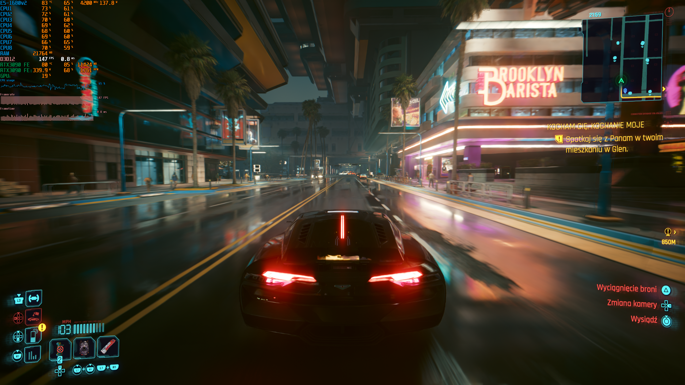

# MFGAmpereUnlock

Enables native NVIDIA DLSS Frame Generation / Multi Frame Generation on **Ada,
Ampere, and Turing** GPUs through a ReShade/RenoDX addon.



[▶ DLSS MFG 4x on Ampere | RTX 3090 | Cyberpunk 2077](https://www.youtube.com/watch?v=RrrmVoKKQMs)

Patches are applied to mapped process memory and reverted on unload. **No NVIDIA
binaries are redistributed.**

## Usage

1. Install [ReShade](https://reshade.me/) with addon support, or the appropriate
   [RenoDX](https://github.com/clshortfuse/renodx) mod for the game.
2. Download the [latest release](../../releases/latest).
3. Place `renodx-mfgunlock.addon64` in the ReShade addon location used by the game.
4. Append the following to `ReShade.ini`:

   ```ini
   [ADDON]
   LoadFromDllMain=renodx-mfgunlock.addon64
   ```

   **If omitted, MFG Unlock will append itself automatically; restart the game
   once afterwards for MFG to be detected.**
5. Use a recent `nvngx_dlssg.dll` if the game ships an older provider without MFG
   support. Back up the original first.
6. Use the game's multiplier selector when available. Otherwise use **Force frame
   multiplier** in the ReShade **MFG Unlock** panel.

## Tested Games

| Game | Ampere | Turing | Ada | Comment |
| --- | --- | --- | --- | --- |
| S.T.A.L.K.E.R. 2: Heart of Chornobyl | | | Working | |
| God of War Ragnarök | | | Working | |
| Hogwarts Legacy | Working | | | |
| Death Stranding 2: On the Beach | | | Working | |
| Clair Obscur: Expedition 33 | Working | | Working | |
| The Last of Us Part II Remastered | | | Working | |
| Resident Evil Requiem | | | Working | |
| Assassin's Creed IV: Black Flag | | | Working | |
| PRAGMATA | | | Working | |
| Cyberpunk 2077 | Working | | Working | |
| Portal with RTX | Partial | | | Native DLSS-G/MFG loads on Ampere; RTX Remix frame pacing remains unresolved |
| Alan Wake 2 | | | Working | |
| Dragon's Dogma 2 | | | Working | |
| The Blood of Dawnwalker | | | Maybe | |
| Starfield | | | Working | |
| Star Wars Outlaws | | | Working | |
| Marvel's Spider-Man 2 | | | Working | |
| Mortal Shell II | | | Working | |
| Resonance: A Plague Tale Legacy | | | Working | |
| A Plague Tale: Requiem | Working | | | Legacy Streamline 1.x |
| Black Myth: Wukong | | | Working | |
| Assetto Corsa Rally | | | Working | |
| Indiana Jones and the Great Circle | | | Working | Launch with `+r_allowBlackListedLayers 1` so ReShade can load through Vulkan |
| Hell Is Us | | | Working | |
| Silent Hill 2 | | | Working | |
| Forza Horizon 6 | | | Working | |
| Assassin's Creed Shadows | | | Working | |
| Stellar Blade | | | Working | |
| Doom the Dark Ages | | | Working | Launch with `+r_allowBlackListedLayers 1` so ReShade can load through Vulkan |
| Horizon Forbidden West | | | Working | |
| 007 The First Light | | | Working | |

*Ada results are inherited from MFGAdaUnlock.*

## Known Multiplier Behavior

| Game | Reaches | Notes |
|---|---|---|
| Cyberpunk 2077 | 6x | Has its own 2x/3x/4x selector; the addon can force beyond it |
| Deep Rock Galactic | 6x | FG is on/off only, so the addon drives the count entirely. Needs a modern `nvngx_dlssg.dll` |
| Grand Theft Auto V Enhanced | 4x | Genuine ceiling — its bundled `sl.dlss_g` 2.9.1.0 clamps to 3 generated frames |
| S.T.A.L.K.E.R. 2: Heart of Chornobyl | 4x | Uses both a bundled snippet and an opaque NVIDIA OTA provider. The addon patches both, bypasses Streamline's stale Ada limit, and exposes 3x/4x through the native menu |

## Requirements

- GeForce RTX 20-, 30-, or 40-series GPU.
- ReShade with addon support.
- A game with NVIDIA DLSS Frame Generation through Streamline or NGX.
- A recent `nvngx_dlssg.dll` when the bundled provider lacks MFG support.

## Vulkan

Vulkan NGX is supported. Some games block third-party Vulkan layers by default.
For **Indiana Jones and the Great Circle** and **Doom: The Dark Ages**, ReShade may
require:

```text
+r_allowBlackListedLayers 1
```

**Portal with RTX** reaches native DLSS-G/MFG on Ampere, but RTX Remix frame
pacing remains unresolved.

## RenoDX DLSS5

MFG Unlock can coexist with RenoDX DLSS5. Keep Streamline and NVIDIA NGX/DLSS
runtime files from matching releases together; do not update only one DLL in the
set.

| Configuration | Result |
|---|---|
| Streamline 2.12.129 with corresponding 310.7.129 NVIDIA DLLs | Working together and individually |
| Streamline 2.14.0 with 310.9 NVIDIA DLLs | Severe menu slowdown reported in STALKER 2 and Cyberpunk 2077 when both addons were loaded |

If the combined setup performs badly, test each addon separately before changing
MFG settings.

## Settings

Settings use `[RenoDX.MFGUnlock]` in `ReShade.ini`.

| Key | Default | Meaning |
|---|---|---|
| `Enabled` | `1` | Enables the addon |
| `Architecture` | `Auto` | `Auto`, `Ada`, `Ampere`, or `Turing` |
| `MaxCount` | `4` | Reported `DLSSG.MultiFrameCountMax` |
| `ForceMultiplier` | `0` | `0` uses the game's choice; `2`–`6` forces a multiplier |
| `TemporalFix` | `1` | Corrects generated-frame temporal positions |
| `ForceFlipMeteringOff` | `0` | Legacy software pacing fallback |
| `RaiseFrameCeiling` | `0` | Raises an old Streamline plugin's compiled limit to 6x |
| `ForceOTAPlugins` | `0` | Requests the driver's OTA plugin set |

## Troubleshooting

### The addon does not appear in ReShade

- Confirm ReShade was installed with full addon support.
- Confirm `renodx-mfgunlock.addon64` is in the addon location used by the game.
- Check the ReShade log for addon loading errors.

### Only Automatic or 2x appears

- Toggle Frame Generation off and on after reaching the graphics menu.
- Confirm the expected DLSS-G provider is loaded.
- Check the MFG Unlock panel for provider and Frame Generation status.

### 3x/4x freezes or pacing becomes unusable

- Leave `ForceFlipMeteringOff=0` with current Streamline builds.
- If higher multipliers specifically freeze, set `ForceFlipMeteringOff=1` and restart.
- Portal with RTX is a separate known RTX Remix pacing case.

### Performance collapses with RenoDX DLSS5

- Test each addon separately.
- Use a matched Streamline/NVIDIA runtime set.
- Restart after addon or runtime changes.

## How it works

MFGAmpereUnlock keeps NVIDIA's native DLSS-G path and adapts the provider for the
selected architecture:

1. `Auto` detects Ada, Ampere, or Turing; an explicit profile can override it.
2. On Ada, the DLSS-G provider already contains compatible `sm_89` code, so only
   the architecture and MFG capability checks need to be adjusted.
3. On Ampere and Turing, the provider's compatible `sm_89` PTX is additionally
   retargeted to `sm_86` or `sm_75` so the NVIDIA driver can JIT-compile it for
   those GPUs.
4. Before changing anything, the addon checks that the loaded DLSS-G provider
   and its embedded CUDA code match a layout it knows how to patch.
5. Only after the provider is ready does the addon make Streamline or NGX report
   Frame Generation as available for the selected GPU.
6. At higher MFG multipliers, the temporal fix makes each generated frame use
   its intended position between the two real frames instead of reusing the
   same midpoint.

Unknown provider layouts are left untouched.

## Building

The addon is built as part of a [RenoDX](https://github.com/clshortfuse/renodx)
tree. The validated Windows build pins NVIDIA/NVAPI commit `87dca62`.

```powershell
git clone --recursive https://github.com/clshortfuse/renodx
Copy-Item -Recurse .\src\addons\mfgunlock .\renodx\src\addons\
Set-Location .\renodx

git clone https://github.com/NVIDIA/nvapi.git external/NVAPI
git -C external/NVAPI checkout 87dca62

$env:CL = '/I"' + (Resolve-Path ".\external\NVAPI").Path + '"'
cmake --preset vs-x64
cmake --build build.vs --config Release --target mfgunlock
Remove-Item Env:CL
```

Output: `build.vs/Release/renodx-mfgunlock.addon64`

Prebuilt binaries are attached to [Releases](../../releases).

## Credits

- https://github.com/dashdogy/RTX40MFG-Unlock
  provided the foundational reverse engineering and original working ASI
  implementation. Dashdogy diagnosed the midpoint compaction bug, demonstrated
  the corrected slot-9 temporal program, established the verified
  Streamline/NGX interception strategy, and showed how to apply the fix only to
  mapped process memory without modifying NVIDIA DLLs on disk.
- Dashdogy's project is published under the
  [MIT License](https://github.com/dashdogy/RTX40MFG-Unlock/blob/main/LICENSE).
  The implementation in `midpoint.hpp` remains independently written for the
  ReShade-addon format and was verified by reproducing the original patcher's
  output digest byte-for-byte.
- [Dreamt](https://github.com/ImDreamt) created the original ReShade/RenoDX addon
  adaptation and repository on which MFGAdaUnlock is based.
- [mavismmg](https://github.com/mavismmg) developed and maintained the
  [MFGAdaUnlock-RenoDx](https://github.com/mavismmg/MFGAdaUnlock-RenoDx) fork,
  extending the Ada implementation with broader game and DLSS-G provider
  compatibility, lifecycle and pacing fixes, Vulkan support, runtime diagnostics,
  and compatibility testing.
- Special thanks to [Coldwood1026](https://github.com/Coldwood1026) for sharing
  `ptx_out.zip` with the DLSS-G PTX and demonstrating successful cubin
  compilation for SM 8.6 and SM 7.5, providing the starting point for the
  Ampere/Turing backport work.
- Special thanks to [mugensc](https://next.nexusmods.com/profile/mugensc) for the
  RenoDX DLSS5 compatibility testing and known-good runtime combination.
- Built on [RenoDX](https://github.com/clshortfuse/renodx) by clshortfuse, and
  [ReShade](https://github.com/crosire/reshade) by crosire.

## Disclaimer

Not affiliated with or endorsed by NVIDIA. This modifies process memory of a
running game. Use it at your own risk; anti-cheat systems may object to injected
addons or modified process memory.

## License

MIT — see [LICENSE](LICENSE).
